Instacart Recommender & Clustering Study
==============================

Recommending new products to Instacart clients

Project Organization
------------

    ├── LICENSE
    ├── README.md
    ├── data
    │   ├── raw
    │   └── interim
    │
    ├── notebooks
    │
    ├── reports
    │   └── figures 
    │	    ├── Clustering
    │       └── EDA
    │
    └── src
        ├── data
        ├── models
        └── visualization 

--------
# Instacart Recommender Project Walkthrough

## Introduction

The goal of this project is to recommend the best possible products for each Instacart client, making use of their previous purchase history and the similarity to other Instacart clients. That will be performed first by clustering the clients in their similarity groups and via user to user cosine similarities and SVD similarity factorization. The number of the different client clusters will have to be found, and the number of recommended products will be 10 for each system and client, avoiding products already bought by the user in the past as well as products already in the client's cart at the momment.

## Getting Data

The data for this project is readily available at the [Instacart dataset website](https://www.instacart.com/datasets/grocery-shopping-2017). This dataset is provided for non-commercial use and was the base of a Kaggle comeptition on August 2017, although the goal of that competition was to predict the client's next purchase, which is a supervised machine learning problem, as opposed to this recommender system, which is an unsupervised machine learning problem.

There is a [GitHub data dictionary page](https://gist.github.com/jeremystan/c3b39d947d9b88b3ccff3147dbcf6c6b) available for a better understanding of the meaning of each column and table, as well as the table size. Nevertheless, I've created a simple database diagram for a quick review of the tables relationship:

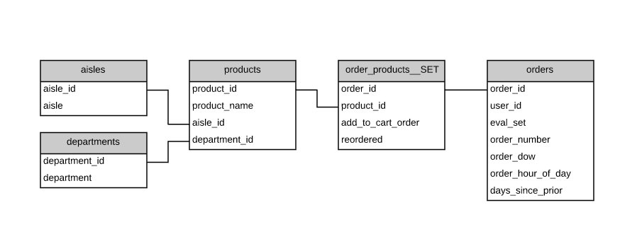

## Clients Clustering

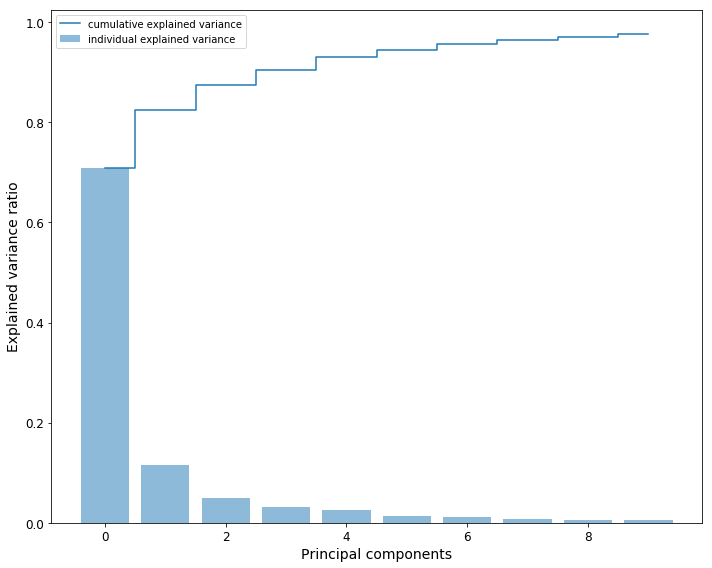

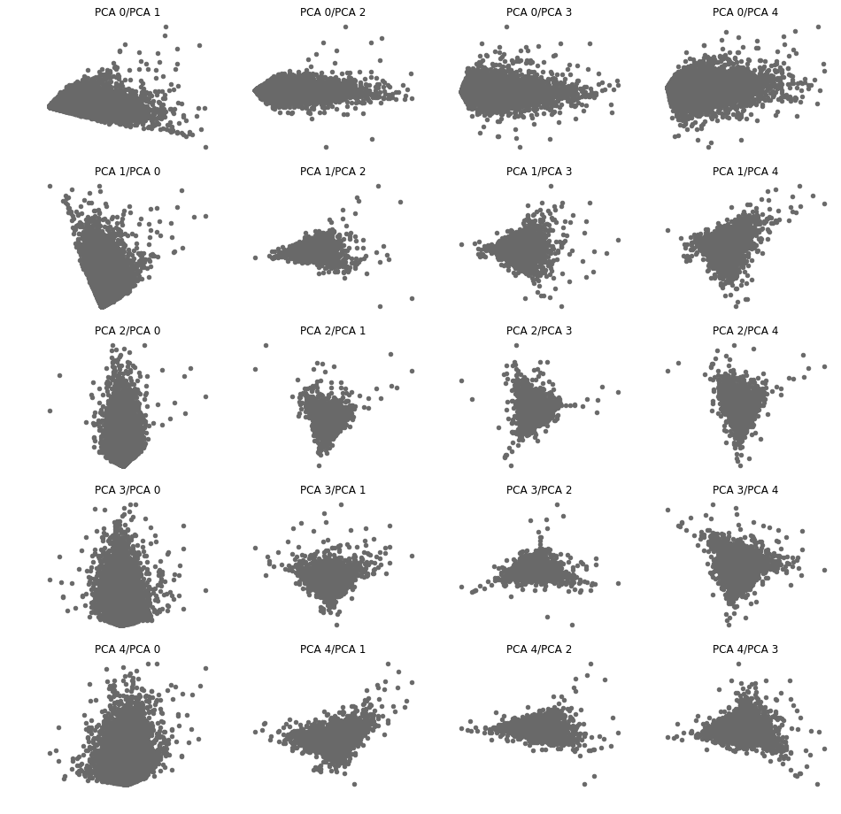

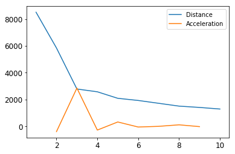

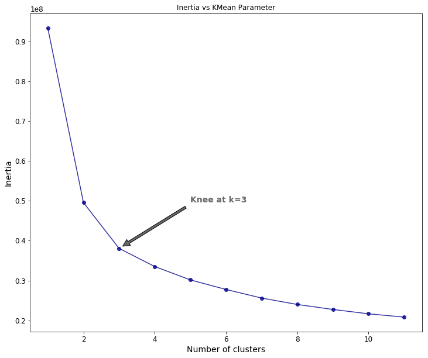

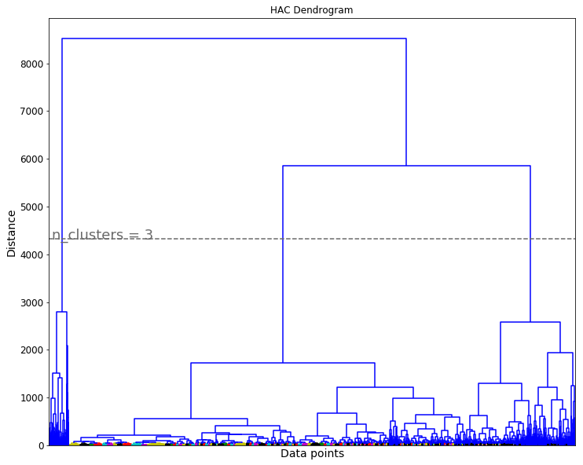

The plot that shows us how the points are clustered within the three first components shows us that the first component, PCA 0, is dominating the rest of the components, since the division is mostly vertical to that component:

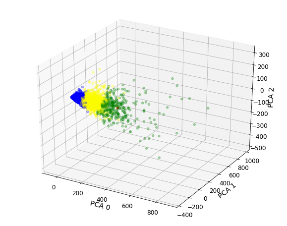

## Exploratory Data Analysis

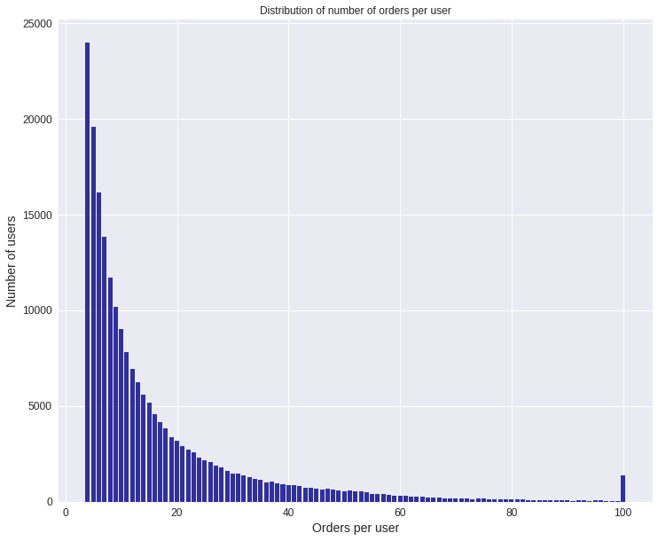

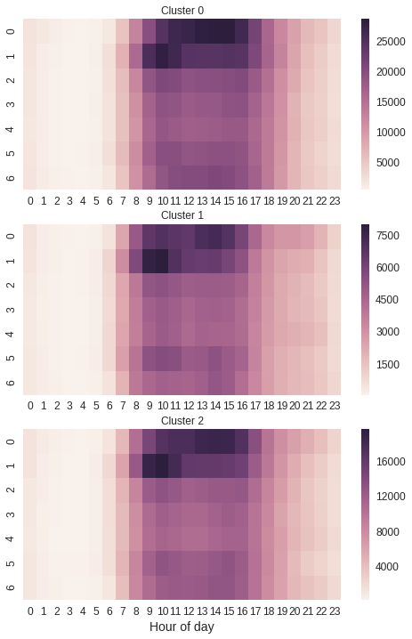

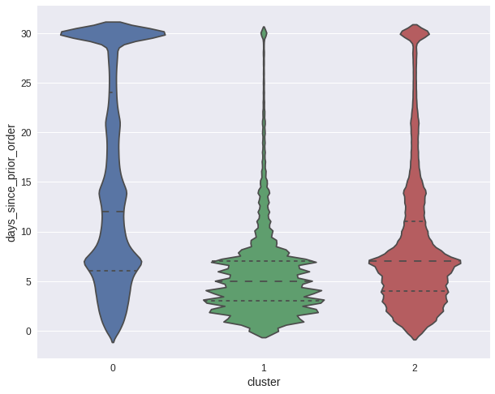

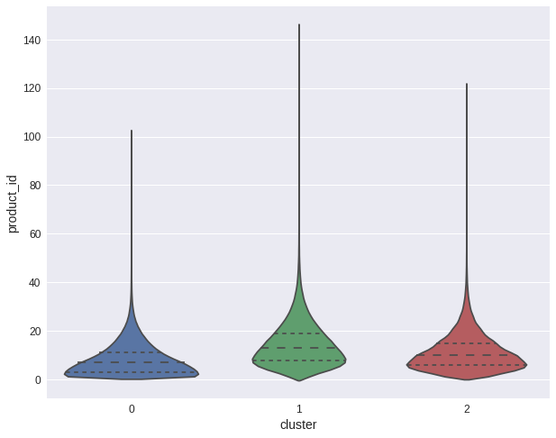

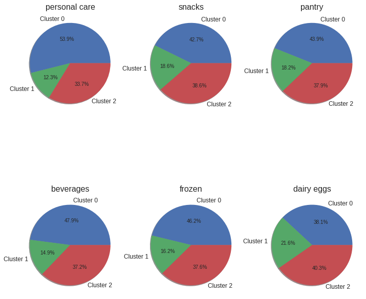

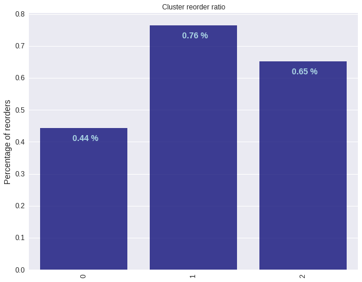

## Recommender Systems

